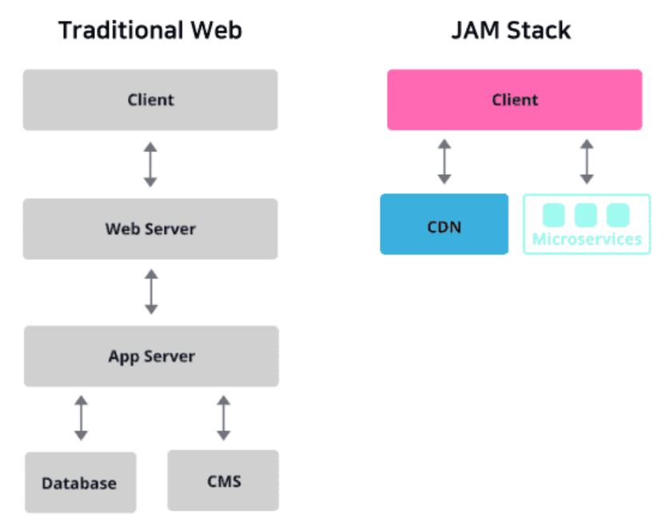
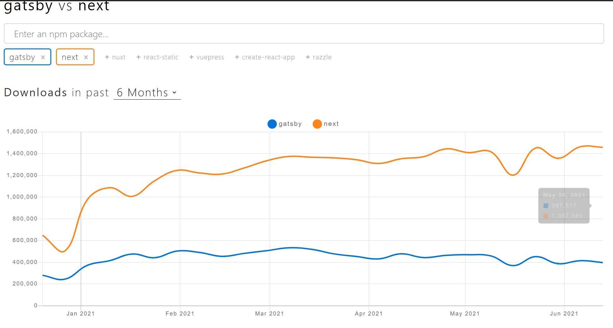

# 1. 프로젝트 소개

+ 이름
	+ Tech_Blog_React_Gatsby
+ 주제
	+ React 기반 Gatsby로 기술 블로그 개발하기
+ 목적
	+ 최신 기술 Stack 경험
	+ 웹개발 구성 환경에 대한 전반적 이해
	+ md 파일을 통한 프로젝트 문서화 skill 향상

-------------------

# 2. 사용된 기술 Stack

+ React, Node.js
+ Gatsby
+ GraphQL
+ TypeScript
+ EmotionJS

## 2.1 Gatsby

Gatsby: JAM Stack을 활용한 정적 사이트 생성기

### 2.1.1 JAM Stack

JAM Stack: JavaScript API, MarkUp Stack의 약자로, 자바스크립트와 API, HTML이나 CSS 등을 칭하는 MarkUp으로 이루어진 웹 구성 방법

### 2.1.2 기존 웹사이트 vs JAM Stack

<br>

<br>

1. 기존 웹사이트의 방식은 대부분 서버에서 데이터베이스 또는 CMS(Content Management System)로부터 추출한 데이터를 프론트엔드에 뿌려주는 방식
2. 사진처럼 클라이언트에 데이터를 보여주기 위해 많은 절차를 거쳐야 해 구조가 복잡함
3. JAM Stack을 사용한 방식은 각종 마크업 요소와 다양한 API를 통해 만든 정적 웹 사이트를 Pre-rendering한 것을 CDN(Content Delivery Network)을 통해 웹 사이트를 열람함

+ 기존의 방식에 비해 더 빠르게 웹 사이트를 제공할 수 있다.
	+ 대부분의 웹 사이트는 처음 접속 시, 서버를 통해 데이터를 받아와 이를 렌더링하는 과정이 필요함
	+ JAM Stack은 렌더링할 화면들을 모두 Pre-rendering하여 제공되어 사용자에게 화면을 보여주기 위해 준비하는 시간을 단축
	+ 브라우저에서 첫 응답을 받기까지 걸리는 시간인 TTFB(Time To First Byte)를 최소화하는데에 미리 빌드된 파일을 CDN을 통해 제공되어

+ 안전한 웹 사이트를 제공할 수 있다.
	+ JAM stack은 API를 통해 정적 사이트를 생성
	+ 여기서 사용되는 API는 JAM Stack을 활용한 각 프레임워크에서의 마이크로 서비스로서, 사이트 생성을 위한 프로세스가 추상화되어 있기 때문에 그만큼 공격 노출 범위가 감소

+ 스케일링하기 쉬운 웹 사이트를 제공할 수 있다.
	+ 정적 웹 사이트에서의 스케일링은 더 많은 지역에서 홈페이지를 제공할 수 있게 하는 의미인데, 미리 빌드된 파일 제공을 담당하는 CDN이 그 역할을 수행

### 2.1.3 Gatsby vs Next

+ Next 
	+ 주로 서버 사이드 렌더링을 위해 사용하는 프레임워크
	+ 서버와 통신을 하며 요청을 받을 때마다 동적으로 웹 사이트를 생성

+ Gatsby
	+ 서버없이, 오로지 정적 사이트 생성을 위해 사용하는 프레임워크
	+ 주로 기업 소개 페이지, 블로그, 포트폴리오 등에 사용

<br>

<br>
 

## 2.2 GraphQL

1. 페이스북에서 개발한 쿼리 언어
2. 각각의 엔드포인트에서 고정된 데이터를 받을 수 있는 Rest API와는 다르게 GraphQL은 단일 엔드포인트에서 원하는 데이터만을 받을 수 있는 것이 장점
3. 데이터 변경을 위한 Mutation, 실시간 기능을 위한 Subscription

```
예제코드

query getMemberInfo {
	member {
		id
		pwd
		name
		age
	}
}
```

## 2.3 TypeScript

1. 리액트에서 타입스크립트를 사용하는 가장 큰 이유는 Types와 Generic을 통해 Props의 Type Checking이 가능하기 때문
2. Type Checking은 컴포넌트의 규모가 커질수록 효과가 큼

## 2.4 EmotionJS

1. EmotionJS 라이브러리는 CSS-in-JS 라이브러리로, 자바스크립트 파일 내에서 스타일을 지정할 수 있는 라이브러리
2. styled-components의 기능을 거의 동일하게 사용 가능
3. 추가적으로 라이브러리를 설치해 손쉽게 기능 확장이 가능
4. 번들 용량이 다른 라이브러리에 비해 압도적으로 작음

-------------------

# 3. 프로젝트 생성

1. npx를 통해 gatsby-cli 라이브러리로 프로젝트 생성

```
npx gatsby-cli new "<프로젝트명>"
```

2. 프로젝트 디렉토리에서 로컬서버 실행

```
gatby develop
```

3. 서버확인

```
<http://localhost:8000/>
```

<br>

<br>

4. 디렉토리 구조 설정
+ root: 프로젝트 디렉토리
  + static: 이미지들을 관리하기 위한 디렉토리
  + contents: 블로그 포스트 관련 파일들을 저장하기 위한 디렉토리
  + src
    + components: React Component를 저장하기 위한 디렉토리
    + hooks: Custom Hook을 저장하기 위한 디렉토리
    + pages: 페이지의 역할을 하는 컴포넌트를 저장하기 위한 디렉토리
    + templates: 게시글 페이지와 같이 페이지의 역할을 하면서 동시에 같은 형식의 여러 컨텐츠를 보여주는 컴포넌트를 저장하기 위한 디렉토리

5. 프로젝트에서 TypeScript를 사용하기 위해 커맨드로 설치

```
yarn add typescript --dev
```

6. Gatsby에서 타입스크립트 사용하기 위한 플러그인 설치

```
yarn add gatsby-plugin-typescript
```

7. EmotionJS 라이브러리 설치

```
yarn add gatsby-plugin-emotion @emotion/react @emotion/styled
```

8. Markdown 처리를 위한 라이브러리 설치
+ gatsby-transformer-remark
  + Markdown Parser 역할
  + 마크다운 문법을 HTML 형태로 변환해 띄워줄 수 있도록 함
+ gatsby-remark-images
  + 마크다운 문서 내에서의 이미지 사용을 최적화함
  + 다양한 반응형 이미지 생성, 동적 로딩 등 다양한 기능 제공
+ gatsby-remark-prismjs & prismjs
  + 문법 하이라이팅 역할
  + 소스코드를 실제 IDE에서 보는 것처럼 변환해주는 기능 제공
+ gatsby-remark-smartypants
  + 글 내에서 사용되는 여러 문장 부호들을 더 깔끔한 부호로 바꿔주는 기능 제공
  + 글의 가독성 향상
+ gatsby-remark-copy-linked-files
  + 마크다운 내에서 사용되는 이미지를 특정 디렉토리로 복사
  + 보통 root/public 디렉토리에 이미지들이 복사됨
+ gatsby-remark-external-links
  + 마크다운 내에서 사용되는 링크 태그의 target, rel 등의 속성을 지정

```
yarn add gatsby-transformer-remark gatsby-remark-images gatsby-remark-prismjs prismjs gatsby-remark-smartypants gatsby-remark-copy-linked-files gatsby-remark-external-links
```

9. 이미지 처리 과정의 효율성을 높이는 gatsby-image 라이브러리 설치

```
yarn add gatsby-image
```

10. 쿼리를 파싱하기 위한 query-string 라이브러리 설치

```
yarn add query-string
```

11. 뒤로가기 기능 추가를 위한 FontAwesome 아이콘 라이브러리 설치

```
yarn add @fortawesome/fontawesome-svg-core @fortawesome/free-solid-svg-icons @fortawesome/react-fontawesome
```

12. 메타 태그를 손쉽게 추가하기 위한 타입스크립트용 react-helmet 라이브러리 설치 

```
yarn add @types/react-helmet
```

13. Canonical Link Element로 표준 페이지 지정을 하기 위한 gatsby-plugin-canonical-urls 라이브러리 설치

```
yarn add gatsby-plugin-canonical-urls
```

14. 프로젝트 빌드시 자동으로 생성되는 페이지에 대해서 Sitemap에 추가해주는 gatsby-plugin-sitemap 라이브러리 설치

```
yarn add gatsby-plugin-sitemap
```

15. Github Pages를 통해 배포를 하기 위한 gh-pages 라이브러리 설치

```
yarn add gh-pages --dev
```

배포 스크립트를 package.json 파일에 추가

```
{
  ...,
  "scripts": {
    "build": "gatsby build",
    "develop": "gatsby develop",
    "format": "prettier --write \\"**/*.{js,jsx,ts,tsx,json,md}\\"",
    "start": "npm run develop",
    "serve": "gatsby serve",
    "clean": "gatsby clean",
    "test": "echo \\"Write tests! -> <https://gatsby.dev/unit-testing\\>" && exit 1",
    "deploy": "gatsby build && gh-pages -d public -b master"
  },
  ...
}
```

16. robots.txt 파일 생성을 위한 라이브러리 세팅
특정 검색 로봇으로 하여금 크롤링을 허용하는 페이지와 허용하지 않는 페이지를 지정

```
yarn add gatsby-plugin-robots-txt
```

16. gatsby-config.js 설정

```
module.exports = {
  siteMetadata: {
    title: `Gatsby Default Starter`,
    description: `Kick off your next, great Gatsby project with this default starter. This barebones starter ships with the main Gatsby configuration files you might need.`,
    author: `@gatsbyjs`,
  },
  plugins: [
    {
      resolve: 'gatsby-plugin-typescript',
      options: {
        isTSX: true,
        allExtensions: true,
      },
    },
    `gatsby-plugin-emotion`,
    `gatsby-plugin-react-helmet`,
    {
      resolve: `gatsby-source-filesystem`,
      options: {
        name: `contents`,
        path: `${__dirname}/contents`,
      },
    },
    {
      resolve: `gatsby-source-filesystem`,
      options: {
        name: `images`,
        path: `${__dirname}/static`,
      },
    },
    `gatsby-transformer-sharp`,
    `gatsby-plugin-sharp`,
    {
      resolve: `gatsby-transformer-remark`,
      options: {
        plugins: [
          {
            resolve: 'gatsby-remark-smartypants',
            options: {
              dashes: 'oldschool',
            },
          },
          {
            resolve: 'gatsby-remark-prismjs',
            options: {
              classPrefix: 'language-',
            },
          },
          {
            resolve: 'gatsby-remark-images',
            options: {
              maxWidth: 768,
              quality: 100,
              withWebp: true,
            },
          },
          {
            resolve: 'gatsby-remark-copy-linked-files',
            options: {},
          },
          {
            resolve: 'gatsby-remark-external-links',
            options: {
              target: '_blank',
              rel: 'nofollow',
            },
          },
          {
            resolve: 'gatsby-plugin-canonical-urls',
            options: {
              siteUrl: 'https://website.com/',
              stripQueryString: true,
            },
          },
          {
            resolve: 'gatsby-plugin-robots-txt',
            options: {
              policy: [{ userAgent: '*', allow: '/' }],
            },
          },
        ],
      },
    },
    'gatsby-plugin-sitemap',
  ],
};
```

17. 타입스크립트 설정파일 생성 -> tsconfig.json

```
yarn tsc --init
```

18. tsconfig.json 설정

```
{
  "compilerOptions": {
    /* Visit https://aka.ms/tsconfig.json to read more about this file */

    /* Basic Options */
    // "incremental": true,                         /* Enable incremental compilation */
    "target": "es5",                                /* Specify ECMAScript target version: 'ES3' (default), 'ES5', 'ES2015', 'ES2016', 'ES2017', 'ES2018', 'ES2019', 'ES2020', 'ES2021', or 'ESNEXT'. */
    "module": "commonjs",                           /* Specify module code generation: 'none', 'commonjs', 'amd', 'system', 'umd', 'es2015', 'es2020', or 'ESNext'. */
    // "lib": [],                                   /* Specify library files to be included in the compilation. */
    "allowJs": true,                             /* Allow javascript files to be compiled. */
    // "checkJs": true,                             /* Report errors in .js files. */
    "jsx": "preserve",                           /* Specify JSX code generation: 'preserve', 'react-native', 'react', 'react-jsx' or 'react-jsxdev'. */
    // "declaration": true,                         /* Generates corresponding '.d.ts' file. */
    // "declarationMap": true,                      /* Generates a sourcemap for each corresponding '.d.ts' file. */
    // "sourceMap": true,                           /* Generates corresponding '.map' file. */
    // "outFile": "./",                             /* Concatenate and emit output to single file. */
    // "outDir": "./",                              /* Redirect output structure to the directory. */
    // "rootDir": "./",                             /* Specify the root directory of input files. Use to control the output directory structure with --outDir. */
    // "composite": true,                           /* Enable project compilation */
    // "tsBuildInfoFile": "./",                     /* Specify file to store incremental compilation information */
    // "removeComments": true,                      /* Do not emit comments to output. */
    // "noEmit": true,                              /* Do not emit outputs. */
    // "importHelpers": true,                       /* Import emit helpers from 'tslib'. */
    // "downlevelIteration": true,                  /* Provide full support for iterables in 'for-of', spread, and destructuring when targeting 'ES5' or 'ES3'. */
    // "isolatedModules": true,                     /* Transpile each file as a separate module (similar to 'ts.transpileModule'). */

    /* Strict Type-Checking Options */
    "strict": true,                                 /* Enable all strict type-checking options. */
    // "noImplicitAny": true,                       /* Raise error on expressions and declarations with an implied 'any' type. */
    // "strictNullChecks": true,                    /* Enable strict null checks. */
    // "strictFunctionTypes": true,                 /* Enable strict checking of function types. */
    // "strictBindCallApply": true,                 /* Enable strict 'bind', 'call', and 'apply' methods on functions. */
    // "strictPropertyInitialization": true,        /* Enable strict checking of property initialization in classes. */
    // "noImplicitThis": true,                      /* Raise error on 'this' expressions with an implied 'any' type. */
    // "alwaysStrict": true,                        /* Parse in strict mode and emit "use strict" for each source file. */

    /* Additional Checks */
    "noUnusedLocals": true,                      /* Report errors on unused locals. */
    "noUnusedParameters": true,                  /* Report errors on unused parameters. */
    "noImplicitReturns": true,                   /* Report error when not all code paths in function return a value. */
    // "noFallthroughCasesInSwitch": true,          /* Report errors for fallthrough cases in switch statement. */
    // "noUncheckedIndexedAccess": true,            /* Include 'undefined' in index signature results */
    // "noImplicitOverride": true,                  /* Ensure overriding members in derived classes are marked with an 'override' modifier. */
    // "noPropertyAccessFromIndexSignature": true,  /* Require undeclared properties from index signatures to use element accesses. */

    /* Module Resolution Options */
    // "moduleResolution": "node",                  /* Specify module resolution strategy: 'node' (Node.js) or 'classic' (TypeScript pre-1.6). */
    "baseUrl": "./src",                             /* Base directory to resolve non-absolute module names. */
    "paths": {
		"components/*": ["./components/*"],
		"utils/*": ["./utils/*"],
		"hooks/*": ["./hooks/*"]
	},                                 /* A series of entries which re-map imports to lookup locations relative to the 'baseUrl'. */
    // "rootDirs": [],                              /* List of root folders whose combined content represents the structure of the project at runtime. */
    // "typeRoots": [],                             /* List of folders to include type definitions from. */
    // "types": [],                                 /* Type declaration files to be included in compilation. */
    // "allowSyntheticDefaultImports": true,        /* Allow default imports from modules with no default export. This does not affect code emit, just typechecking. */
    "esModuleInterop": true,                        /* Enables emit interoperability between CommonJS and ES Modules via creation of namespace objects for all imports. Implies 'allowSyntheticDefaultImports'. */
    // "preserveSymlinks": true,                    /* Do not resolve the real path of symlinks. */
    // "allowUmdGlobalAccess": true,                /* Allow accessing UMD globals from modules. */

    /* Source Map Options */
    // "sourceRoot": "",                            /* Specify the location where debugger should locate TypeScript files instead of source locations. */
    // "mapRoot": "",                               /* Specify the location where debugger should locate map files instead of generated locations. */
    // "inlineSourceMap": true,                     /* Emit a single file with source maps instead of having a separate file. */
    // "inlineSources": true,                       /* Emit the source alongside the sourcemaps within a single file; requires '--inlineSourceMap' or '--sourceMap' to be set. */

    /* Experimental Options */
    // "experimentalDecorators": true,              /* Enables experimental support for ES7 decorators. */
    // "emitDecoratorMetadata": true,               /* Enables experimental support for emitting type metadata for decorators. */

    /* Advanced Options */
    "skipLibCheck": true,                           /* Skip type checking of declaration files. */
    "forceConsistentCasingInFileNames": true,        /* Disallow inconsistently-cased references to the same file. */
	"resolveJsonModule": true
  },
  "include": ["src/**/*.tsx"],
  "exclude": ["node_modules"]
}
```

19. gatsby-node.js 파일에서 Webpack Config 추가

```
/**
 * Implement Gatsby's Node APIs in this file.
 *
 * See: <https://www.gatsbyjs.com/docs/node-apis/>
 */

// You can delete this file if you're not using it

const path = require('path');

// Setup Import Alias
exports.onCreateWebpackConfig = ({ getConfig, actions }) => {
  const output = getConfig().output || {};

  actions.setWebpackConfig({
    output,
    resolve: {
      alias: {
        components: path.resolve(__dirname, 'src/components'),
        utils: path.resolve(__dirname, 'src/utils'),
        hooks: path.resolve(__dirname, 'src/hooks'),
      },
    },
  });
};
```

20. pages 디렉토리에 index.tsx 파일 생성

```
import React, { FunctionComponent } from 'react';
import { Link } from 'gatsby';

const IndexPage: FunctionComponent = function () {
    return (
        <div>
            <Link to="/info/">To Info</Link>
        </div>
    );
};

export default IndexPage;
```

21. pages 디렉토리에 info.tsx 파일 생성

```
import React, { FunctionComponent } from 'react';
import { graphql } from 'gatsby';

interface InfoPageProps {
    data: {
        site: {
            siteMetadata: {
                title: string;
                description: string;
                author: string;
            };
        };
    };
}

const InfoPage: FunctionComponent<InfoPageProps> = function ({
    data: {
        site: {
            siteMetadata: { title, description, author },
        },
    },
}) {
    return (
        <div>
            {title} {description} {author}
        </div>
    );
};

export default InfoPage;

export const metadataQuery = graphql`
    {
        site {
            siteMetadata {
                title
                description
                author
            }
        }
    }
`;
```

22. 로컬 서버를 실행해 적용 사항들을 확인

```
yarn develop
```


